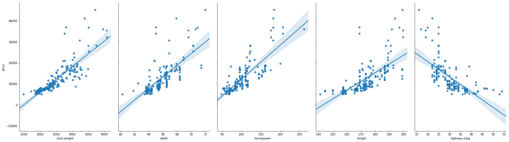
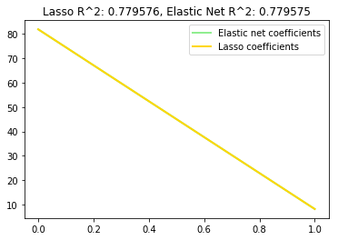

```python
import pandas as pd
import numpy as np
```


```python
cars = pd.read_csv('Automobiles-Data1.csv')
test_cars = pd.read_csv('Automobiles-Testing1.csv')
#test_cars.head(5)
cars.head(5)
```


<div>
<style>
    .dataframe thead tr:only-child th {
        text-align: right;
    }

    .dataframe thead th {
        text-align: left;
    }

    .dataframe tbody tr th {
        vertical-align: top;
    }
</style>
<table border="1" class="dataframe">
  <thead>
    <tr style="text-align: right;">
      <th></th>
      <th>symboling</th>
      <th>normalized-losses</th>
      <th>make</th>
      <th>fuel-type</th>
      <th>aspiration</th>
      <th>num-of-doors</th>
      <th>body-style</th>
      <th>drive-wheels</th>
      <th>engine-location</th>
      <th>wheel-base</th>
      <th>...</th>
      <th>engine-size</th>
      <th>fuel-system</th>
      <th>bore</th>
      <th>stroke</th>
      <th>compression-ratio</th>
      <th>horsepower</th>
      <th>peak-rpm</th>
      <th>city-mpg</th>
      <th>highway-mpg</th>
      <th>price</th>
    </tr>
  </thead>
  <tbody>
    <tr>
      <th>0</th>
      <td>3</td>
      <td>?</td>
      <td>alfa-romero</td>
      <td>gas</td>
      <td>std</td>
      <td>two</td>
      <td>convertible</td>
      <td>rwd</td>
      <td>front</td>
      <td>88.6</td>
      <td>...</td>
      <td>130</td>
      <td>mpfi</td>
      <td>3.47</td>
      <td>2.68</td>
      <td>9.0</td>
      <td>111</td>
      <td>5000</td>
      <td>21</td>
      <td>27</td>
      <td>13495</td>
    </tr>
    <tr>
      <th>1</th>
      <td>3</td>
      <td>?</td>
      <td>alfa-romero</td>
      <td>gas</td>
      <td>std</td>
      <td>two</td>
      <td>convertible</td>
      <td>rwd</td>
      <td>front</td>
      <td>88.6</td>
      <td>...</td>
      <td>130</td>
      <td>mpfi</td>
      <td>3.47</td>
      <td>2.68</td>
      <td>9.0</td>
      <td>111</td>
      <td>5000</td>
      <td>21</td>
      <td>27</td>
      <td>16500</td>
    </tr>
    <tr>
      <th>2</th>
      <td>1</td>
      <td>?</td>
      <td>alfa-romero</td>
      <td>gas</td>
      <td>std</td>
      <td>two</td>
      <td>hatchback</td>
      <td>rwd</td>
      <td>front</td>
      <td>94.5</td>
      <td>...</td>
      <td>152</td>
      <td>mpfi</td>
      <td>2.68</td>
      <td>3.47</td>
      <td>9.0</td>
      <td>154</td>
      <td>5000</td>
      <td>19</td>
      <td>26</td>
      <td>16500</td>
    </tr>
    <tr>
      <th>3</th>
      <td>2</td>
      <td>164</td>
      <td>audi</td>
      <td>gas</td>
      <td>std</td>
      <td>four</td>
      <td>sedan</td>
      <td>fwd</td>
      <td>front</td>
      <td>99.8</td>
      <td>...</td>
      <td>109</td>
      <td>mpfi</td>
      <td>3.19</td>
      <td>3.4</td>
      <td>10.0</td>
      <td>102</td>
      <td>5500</td>
      <td>24</td>
      <td>30</td>
      <td>13950</td>
    </tr>
    <tr>
      <th>4</th>
      <td>2</td>
      <td>164</td>
      <td>audi</td>
      <td>gas</td>
      <td>std</td>
      <td>four</td>
      <td>sedan</td>
      <td>4wd</td>
      <td>front</td>
      <td>99.4</td>
      <td>...</td>
      <td>136</td>
      <td>mpfi</td>
      <td>3.19</td>
      <td>3.4</td>
      <td>8.0</td>
      <td>115</td>
      <td>5500</td>
      <td>18</td>
      <td>22</td>
      <td>17450</td>
    </tr>
  </tbody>
</table>
<p>5 rows × 26 columns</p>
</div>


```python
ordinal_values_cols = ['normalized-losses', 'wheel-base', 'make','length', 'width', 'height','curb-weight', 'bore', 'stroke', 'compression-ratio', 'horsepower', 'peak-rpm', 'city-mpg', 'highway-mpg', 'price']
test_ordinal_values_cols = ['normalized-losses', 'wheel-base', 'length', 'width', 'height', 'curb-weight', 'bore', 'stroke', 'compression-ratio', 'horsepower', 'peak-rpm', 'city-mpg', 'highway-mpg']
car_features = cars[ordinal_values_cols]
test_car_features = test_cars[test_ordinal_values_cols]
test_car_features.head(5)
```


<div>
<style>
    .dataframe thead tr:only-child th {
        text-align: right;
    }

    .dataframe thead th {
        text-align: left;
    }

    .dataframe tbody tr th {
        vertical-align: top;
    }
</style>
<table border="1" class="dataframe">
  <thead>
    <tr style="text-align: right;">
      <th></th>
      <th>normalized-losses</th>
      <th>wheel-base</th>
      <th>length</th>
      <th>width</th>
      <th>height</th>
      <th>curb-weight</th>
      <th>bore</th>
      <th>stroke</th>
      <th>compression-ratio</th>
      <th>horsepower</th>
      <th>peak-rpm</th>
      <th>city-mpg</th>
      <th>highway-mpg</th>
    </tr>
  </thead>
  <tbody>
    <tr>
      <th>0</th>
      <td>103</td>
      <td>104.3</td>
      <td>188.8</td>
      <td>67.2</td>
      <td>56.2</td>
      <td>2912</td>
      <td>3.78</td>
      <td>3.15</td>
      <td>9.5</td>
      <td>114</td>
      <td>5400</td>
      <td>23</td>
      <td>28</td>
    </tr>
    <tr>
      <th>1</th>
      <td>74</td>
      <td>104.3</td>
      <td>188.8</td>
      <td>67.2</td>
      <td>57.5</td>
      <td>3034</td>
      <td>3.78</td>
      <td>3.15</td>
      <td>9.5</td>
      <td>114</td>
      <td>5400</td>
      <td>23</td>
      <td>28</td>
    </tr>
    <tr>
      <th>2</th>
      <td>95</td>
      <td>109.1</td>
      <td>188.8</td>
      <td>68.9</td>
      <td>55.5</td>
      <td>2952</td>
      <td>3.78</td>
      <td>3.15</td>
      <td>9.5</td>
      <td>114</td>
      <td>5400</td>
      <td>23</td>
      <td>28</td>
    </tr>
    <tr>
      <th>3</th>
      <td>95</td>
      <td>109.1</td>
      <td>188.8</td>
      <td>68.8</td>
      <td>55.5</td>
      <td>3049</td>
      <td>3.78</td>
      <td>3.15</td>
      <td>8.7</td>
      <td>160</td>
      <td>5300</td>
      <td>19</td>
      <td>25</td>
    </tr>
    <tr>
      <th>4</th>
      <td>95</td>
      <td>109.1</td>
      <td>188.8</td>
      <td>68.9</td>
      <td>55.5</td>
      <td>3217</td>
      <td>3.01</td>
      <td>3.40</td>
      <td>23.0</td>
      <td>106</td>
      <td>4800</td>
      <td>26</td>
      <td>27</td>
    </tr>
  </tbody>
</table>
</div>


```python
from sklearn.preprocessing import LabelEncoder
lb_make = LabelEncoder()
car_features['make'] = lb_make.fit_transform(car_features['make'])

```

    C:\ProgramData\Anaconda3\lib\site-packages\ipykernel_launcher.py:3: SettingWithCopyWarning: 
    A value is trying to be set on a copy of a slice from a DataFrame.
    Try using .loc[row_indexer,col_indexer] = value instead
    
    See the caveats in the documentation: http://pandas.pydata.org/pandas-docs/stable/indexing.html#indexing-view-versus-copy
      This is separate from the ipykernel package so we can avoid doing imports until
    


```python
car_features['make'].head(11)

```


    0     0
    1     0
    2     0
    3     1
    4     1
    5     1
    6     1
    7     1
    8     2
    9     2
    10    2
    Name: make, dtype: int64


```python
#Replace all ? values with NaN values
car_features.replace('?', np.nan, inplace=True)
test_car_features.replace('?', np.nan, inplace=True)
#Make sure all values are type float
car_features = car_features.astype(float)
test_car_features = test_car_features.astype(float)
car_features.shape[0]
#test_car_features.shape[0]
test_car_features.head(5)
```

    C:\ProgramData\Anaconda3\lib\site-packages\ipykernel_launcher.py:2: SettingWithCopyWarning: 
    A value is trying to be set on a copy of a slice from a DataFrame
    
    See the caveats in the documentation: http://pandas.pydata.org/pandas-docs/stable/indexing.html#indexing-view-versus-copy
      
    C:\ProgramData\Anaconda3\lib\site-packages\ipykernel_launcher.py:3: SettingWithCopyWarning: 
    A value is trying to be set on a copy of a slice from a DataFrame
    
    See the caveats in the documentation: http://pandas.pydata.org/pandas-docs/stable/indexing.html#indexing-view-versus-copy
      This is separate from the ipykernel package so we can avoid doing imports until
    


<div>
<style>
    .dataframe thead tr:only-child th {
        text-align: right;
    }

    .dataframe thead th {
        text-align: left;
    }

    .dataframe tbody tr th {
        vertical-align: top;
    }
</style>
<table border="1" class="dataframe">
  <thead>
    <tr style="text-align: right;">
      <th></th>
      <th>normalized-losses</th>
      <th>wheel-base</th>
      <th>length</th>
      <th>width</th>
      <th>height</th>
      <th>curb-weight</th>
      <th>bore</th>
      <th>stroke</th>
      <th>compression-ratio</th>
      <th>horsepower</th>
      <th>peak-rpm</th>
      <th>city-mpg</th>
      <th>highway-mpg</th>
    </tr>
  </thead>
  <tbody>
    <tr>
      <th>0</th>
      <td>103.0</td>
      <td>104.3</td>
      <td>188.8</td>
      <td>67.2</td>
      <td>56.2</td>
      <td>2912.0</td>
      <td>3.78</td>
      <td>3.15</td>
      <td>9.5</td>
      <td>114.0</td>
      <td>5400.0</td>
      <td>23.0</td>
      <td>28.0</td>
    </tr>
    <tr>
      <th>1</th>
      <td>74.0</td>
      <td>104.3</td>
      <td>188.8</td>
      <td>67.2</td>
      <td>57.5</td>
      <td>3034.0</td>
      <td>3.78</td>
      <td>3.15</td>
      <td>9.5</td>
      <td>114.0</td>
      <td>5400.0</td>
      <td>23.0</td>
      <td>28.0</td>
    </tr>
    <tr>
      <th>2</th>
      <td>95.0</td>
      <td>109.1</td>
      <td>188.8</td>
      <td>68.9</td>
      <td>55.5</td>
      <td>2952.0</td>
      <td>3.78</td>
      <td>3.15</td>
      <td>9.5</td>
      <td>114.0</td>
      <td>5400.0</td>
      <td>23.0</td>
      <td>28.0</td>
    </tr>
    <tr>
      <th>3</th>
      <td>95.0</td>
      <td>109.1</td>
      <td>188.8</td>
      <td>68.8</td>
      <td>55.5</td>
      <td>3049.0</td>
      <td>3.78</td>
      <td>3.15</td>
      <td>8.7</td>
      <td>160.0</td>
      <td>5300.0</td>
      <td>19.0</td>
      <td>25.0</td>
    </tr>
    <tr>
      <th>4</th>
      <td>95.0</td>
      <td>109.1</td>
      <td>188.8</td>
      <td>68.9</td>
      <td>55.5</td>
      <td>3217.0</td>
      <td>3.01</td>
      <td>3.40</td>
      <td>23.0</td>
      <td>106.0</td>
      <td>4800.0</td>
      <td>26.0</td>
      <td>27.0</td>
    </tr>
  </tbody>
</table>
</div>


```python
car_features = car_features.dropna(subset=['price'])
test_car_features.isnull().sum()
car_features.isnull().sum()
```


    normalized-losses    33
    wheel-base            0
    make                  0
    length                0
    width                 0
    height                0
    curb-weight           0
    bore                  4
    stroke                4
    compression-ratio     0
    horsepower            2
    peak-rpm              2
    city-mpg              0
    highway-mpg           0
    price                 0
    dtype: int64


```python
car_features = car_features.fillna(car_features.mean())

test_car_features = test_car_features.fillna(test_car_features.mean())
test_car_features.isnull().sum()
car_features.isnull().sum()
#With those rows disposed off, I will replace any remaining null values with the mean value of their respective column.
```


    normalized-losses    0
    wheel-base           0
    make                 0
    length               0
    width                0
    height               0
    curb-weight          0
    bore                 0
    stroke               0
    compression-ratio    0
    horsepower           0
    peak-rpm             0
    city-mpg             0
    highway-mpg          0
    price                0
    dtype: int64


```python
car_features.head(5)

```


<div>
<style>
    .dataframe thead tr:only-child th {
        text-align: right;
    }

    .dataframe thead th {
        text-align: left;
    }

    .dataframe tbody tr th {
        vertical-align: top;
    }
</style>
<table border="1" class="dataframe">
  <thead>
    <tr style="text-align: right;">
      <th></th>
      <th>normalized-losses</th>
      <th>wheel-base</th>
      <th>make</th>
      <th>length</th>
      <th>width</th>
      <th>height</th>
      <th>curb-weight</th>
      <th>bore</th>
      <th>stroke</th>
      <th>compression-ratio</th>
      <th>horsepower</th>
      <th>peak-rpm</th>
      <th>city-mpg</th>
      <th>highway-mpg</th>
      <th>price</th>
    </tr>
  </thead>
  <tbody>
    <tr>
      <th>0</th>
      <td>122.685714</td>
      <td>88.6</td>
      <td>0.0</td>
      <td>168.8</td>
      <td>64.1</td>
      <td>48.8</td>
      <td>2548.0</td>
      <td>3.47</td>
      <td>2.68</td>
      <td>9.0</td>
      <td>111.0</td>
      <td>5000.0</td>
      <td>21.0</td>
      <td>27.0</td>
      <td>13495.0</td>
    </tr>
    <tr>
      <th>1</th>
      <td>122.685714</td>
      <td>88.6</td>
      <td>0.0</td>
      <td>168.8</td>
      <td>64.1</td>
      <td>48.8</td>
      <td>2548.0</td>
      <td>3.47</td>
      <td>2.68</td>
      <td>9.0</td>
      <td>111.0</td>
      <td>5000.0</td>
      <td>21.0</td>
      <td>27.0</td>
      <td>16500.0</td>
    </tr>
    <tr>
      <th>2</th>
      <td>122.685714</td>
      <td>94.5</td>
      <td>0.0</td>
      <td>171.2</td>
      <td>65.5</td>
      <td>52.4</td>
      <td>2823.0</td>
      <td>2.68</td>
      <td>3.47</td>
      <td>9.0</td>
      <td>154.0</td>
      <td>5000.0</td>
      <td>19.0</td>
      <td>26.0</td>
      <td>16500.0</td>
    </tr>
    <tr>
      <th>3</th>
      <td>164.000000</td>
      <td>99.8</td>
      <td>1.0</td>
      <td>176.6</td>
      <td>66.2</td>
      <td>54.3</td>
      <td>2337.0</td>
      <td>3.19</td>
      <td>3.40</td>
      <td>10.0</td>
      <td>102.0</td>
      <td>5500.0</td>
      <td>24.0</td>
      <td>30.0</td>
      <td>13950.0</td>
    </tr>
    <tr>
      <th>4</th>
      <td>164.000000</td>
      <td>99.4</td>
      <td>1.0</td>
      <td>176.6</td>
      <td>66.4</td>
      <td>54.3</td>
      <td>2824.0</td>
      <td>3.19</td>
      <td>3.40</td>
      <td>8.0</td>
      <td>115.0</td>
      <td>5500.0</td>
      <td>18.0</td>
      <td>22.0</td>
      <td>17450.0</td>
    </tr>
  </tbody>
</table>
</div>


```python
car_features.to_csv('car_features.csv')
test_car_features.to_csv('test_car_features.csv')
```


```python
import seaborn as sns
%matplotlib inline
```


```python
sns.pairplot(car_features, x_vars=['curb-weight','width','horsepower','length','highway-mpg'], y_vars='price', size=7, aspect=0.7, kind='reg')
```


    <seaborn.axisgrid.PairGrid at 0x146bfce99e8>





```python
feature_cols=['curb-weight','width','horsepower']
X = car_features[feature_cols]
y = car_features['price']
```


```python
from sklearn.cross_validation import train_test_split
X_train, X_test, y_train, y_test = train_test_split(X, y, random_state=1)
```

    C:\ProgramData\Anaconda3\lib\site-packages\sklearn\cross_validation.py:41: DeprecationWarning: This module was deprecated in version 0.18 in favor of the model_selection module into which all the refactored classes and functions are moved. Also note that the interface of the new CV iterators are different from that of this module. This module will be removed in 0.20.
      "This module will be removed in 0.20.", DeprecationWarning)
    


```python
print(X_train.shape)
print(y_train.shape)
print(X_test.shape)
print(y_test.shape)
```

    (129, 3)
    (129,)
    (44, 3)
    (44,)
    


```python
# import model
from sklearn.linear_model import LinearRegression

# instantiate
linreg = LinearRegression()

# fit the model to the training data (learn the coefficients)
linreg.fit(X_train, y_train)
```


    LinearRegression(copy_X=True, fit_intercept=True, n_jobs=1, normalize=False)


```python
print(linreg.intercept_)
print(linreg.coef_)
list(zip(feature_cols, linreg.coef_))
```

    -108978.484441
    [ 1673.72602578   114.03903446]
    


    [('width', 1673.7260257767114), ('horsepower', 114.03903446298783)]


```python
y_pred = linreg.predict(X_test)

```


```python
from sklearn import metrics
print(np.sqrt(metrics.mean_squared_error(y_test, y_pred)))
```

    3870.70122457
    


```python
feature_cols = ['horsepower','curb-weight']

# use the list to select a subset of the original DataFrame
X = car_features[feature_cols]

# select a Series from the DataFrame
y = car_features.price

# split into training and testing sets
X_train, X_test, y_train, y_test = train_test_split(X, y, random_state=1)

# fit the model to the training data (learn the coefficients)
linreg.fit(X_train, y_train)

# make predictions on the testing set
y_pred = linreg.predict(X_test)

# compute the RMSE of our predictions
print(np.sqrt(metrics.mean_squared_error(y_test, y_pred)))
```

    3571.17653424
    


```python
predictions = linreg.predict(test_car_features[feature_cols])
test_car_features['price'] = predictions
test_car_features.to_csv('linear_out.csv')
```


```python
# #############################################################################
# Lasso
from sklearn.metrics import r2_score
from sklearn.linear_model import Lasso

alpha = 0.1
lasso = Lasso(alpha=alpha)

y_pred_lasso = lasso.fit(X_train, y_train).predict(X_test)
r2_score_lasso = r2_score(y_test, y_pred_lasso)
print(lasso)
print("r^2 on test data : %f" % r2_score_lasso)
```

    Lasso(alpha=0.1, copy_X=True, fit_intercept=True, max_iter=1000,
       normalize=False, positive=False, precompute=False, random_state=None,
       selection='cyclic', tol=0.0001, warm_start=False)
    r^2 on test data : 0.779576
    


```python
# #############################################################################
# ElasticNet
import matplotlib.pyplot as plt
from sklearn.linear_model import ElasticNet

enet = ElasticNet(alpha=alpha, l1_ratio=0.7)

y_pred_enet = enet.fit(X_train, y_train).predict(X_test)
r2_score_enet = r2_score(y_test, y_pred_enet)
print(enet)
print("r^2 on test data : %f" % r2_score_enet)

plt.plot(enet.coef_, color='lightgreen', linewidth=2,
         label='Elastic net coefficients')
plt.plot(lasso.coef_, color='gold', linewidth=2,
         label='Lasso coefficients')
#plt.plot(coef, '--', color='navy', label='original coefficients')
plt.legend(loc='best')
plt.title("Lasso R^2: %f, Elastic Net R^2: %f"
          % (r2_score_lasso, r2_score_enet))
plt.show()
```

    ElasticNet(alpha=0.1, copy_X=True, fit_intercept=True, l1_ratio=0.7,
          max_iter=1000, normalize=False, positive=False, precompute=False,
          random_state=None, selection='cyclic', tol=0.0001, warm_start=False)
    r^2 on test data : 0.779575
    




