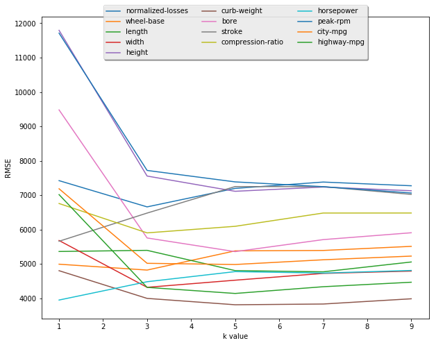
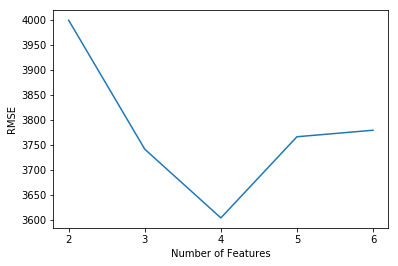
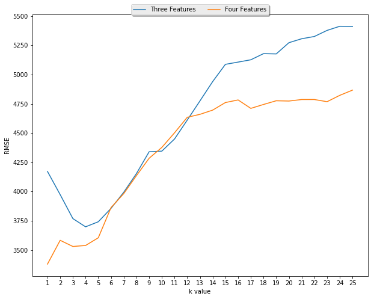
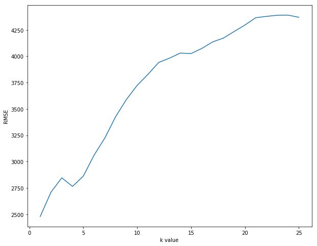

```python
# Applying K-Nearest Neighbors: Predicting Car Prices
import numpy as np
from sklearn.model_selection import cross_val_score, KFold
from sklearn.neighbors import KNeighborsRegressor
from sklearn.metrics import mean_squared_error
from sklearn.model_selection import KFold, cross_val_score
from collections import defaultdict
import matplotlib.pyplot as plt
%matplotlib inline
```


```python
cars = pd.read_csv('Automobiles-Data1.csv')
cars.head(5)
test_cars = pd.read_csv('Automobiles-Testing1.csv')
test_cars.head(5)
# As you can see the data is a little messy. 
```


```python
ordinal_values_cols = ['normalized-losses', 'wheel-base', 'length', 'width', 'height', 'curb-weight', 'bore', 'stroke', 'compression-ratio', 'horsepower', 'peak-rpm', 'city-mpg', 'highway-mpg', 'price']
test_ordinal_values_cols = ['normalized-losses', 'wheel-base', 'length', 'width', 'height', 'curb-weight', 'bore', 'stroke', 'compression-ratio', 'horsepower', 'peak-rpm', 'city-mpg', 'highway-mpg']
car_features = cars[ordinal_values_cols]
test_car_features = test_cars[test_ordinal_values_cols]
test_car_features.head(5)
#When training a predictive model, it is important to not have any missing values. Based on the data set preview from the last step, I can tell that the normalized-losses column contains missing values represented using "?". 
#Let's replace these values and look for the presence of missing values in other numeric columns. Let's also normalize the values in all numeric columns so they have a value between zero and one. That way very large values will not have a greater influence, and everything will be relative.
```


<div>
<style>
    .dataframe thead tr:only-child th {
        text-align: right;
    }

    .dataframe thead th {
        text-align: left;
    }

    .dataframe tbody tr th {
        vertical-align: top;
    }
</style>
<table border="1" class="dataframe">
  <thead>
    <tr style="text-align: right;">
      <th></th>
      <th>normalized-losses</th>
      <th>wheel-base</th>
      <th>length</th>
      <th>width</th>
      <th>height</th>
      <th>curb-weight</th>
      <th>bore</th>
      <th>stroke</th>
      <th>compression-ratio</th>
      <th>horsepower</th>
      <th>peak-rpm</th>
      <th>city-mpg</th>
      <th>highway-mpg</th>
    </tr>
  </thead>
  <tbody>
    <tr>
      <th>0</th>
      <td>103</td>
      <td>104.3</td>
      <td>188.8</td>
      <td>67.2</td>
      <td>56.2</td>
      <td>2912</td>
      <td>3.78</td>
      <td>3.15</td>
      <td>9.5</td>
      <td>114</td>
      <td>5400</td>
      <td>23</td>
      <td>28</td>
    </tr>
    <tr>
      <th>1</th>
      <td>74</td>
      <td>104.3</td>
      <td>188.8</td>
      <td>67.2</td>
      <td>57.5</td>
      <td>3034</td>
      <td>3.78</td>
      <td>3.15</td>
      <td>9.5</td>
      <td>114</td>
      <td>5400</td>
      <td>23</td>
      <td>28</td>
    </tr>
    <tr>
      <th>2</th>
      <td>95</td>
      <td>109.1</td>
      <td>188.8</td>
      <td>68.9</td>
      <td>55.5</td>
      <td>2952</td>
      <td>3.78</td>
      <td>3.15</td>
      <td>9.5</td>
      <td>114</td>
      <td>5400</td>
      <td>23</td>
      <td>28</td>
    </tr>
    <tr>
      <th>3</th>
      <td>95</td>
      <td>109.1</td>
      <td>188.8</td>
      <td>68.8</td>
      <td>55.5</td>
      <td>3049</td>
      <td>3.78</td>
      <td>3.15</td>
      <td>8.7</td>
      <td>160</td>
      <td>5300</td>
      <td>19</td>
      <td>25</td>
    </tr>
    <tr>
      <th>4</th>
      <td>95</td>
      <td>109.1</td>
      <td>188.8</td>
      <td>68.9</td>
      <td>55.5</td>
      <td>3217</td>
      <td>3.01</td>
      <td>3.40</td>
      <td>23.0</td>
      <td>106</td>
      <td>4800</td>
      <td>26</td>
      <td>27</td>
    </tr>
  </tbody>
</table>
</div>


```python
#Replace all ? values with NaN values
car_features.replace('?', np.nan, inplace=True)
test_car_features.replace('?', np.nan, inplace=True)
#Make sure all values are type float
car_features = car_features.astype(float)
test_car_features = test_car_features.astype(float)
car_features.shape[0]
#test_car_features.shape[0]
test_car_features.head(5)

```

    C:\ProgramData\Anaconda3\lib\site-packages\ipykernel_launcher.py:2: SettingWithCopyWarning: 
    A value is trying to be set on a copy of a slice from a DataFrame
    
    See the caveats in the documentation: http://pandas.pydata.org/pandas-docs/stable/indexing.html#indexing-view-versus-copy
      
    C:\ProgramData\Anaconda3\lib\site-packages\ipykernel_launcher.py:3: SettingWithCopyWarning: 
    A value is trying to be set on a copy of a slice from a DataFrame
    
    See the caveats in the documentation: http://pandas.pydata.org/pandas-docs/stable/indexing.html#indexing-view-versus-copy
      This is separate from the ipykernel package so we can avoid doing imports until
    


<div>
<style>
    .dataframe thead tr:only-child th {
        text-align: right;
    }

    .dataframe thead th {
        text-align: left;
    }

    .dataframe tbody tr th {
        vertical-align: top;
    }
</style>
<table border="1" class="dataframe">
  <thead>
    <tr style="text-align: right;">
      <th></th>
      <th>normalized-losses</th>
      <th>wheel-base</th>
      <th>length</th>
      <th>width</th>
      <th>height</th>
      <th>curb-weight</th>
      <th>bore</th>
      <th>stroke</th>
      <th>compression-ratio</th>
      <th>horsepower</th>
      <th>peak-rpm</th>
      <th>city-mpg</th>
      <th>highway-mpg</th>
    </tr>
  </thead>
  <tbody>
    <tr>
      <th>0</th>
      <td>103.0</td>
      <td>104.3</td>
      <td>188.8</td>
      <td>67.2</td>
      <td>56.2</td>
      <td>2912.0</td>
      <td>3.78</td>
      <td>3.15</td>
      <td>9.5</td>
      <td>114.0</td>
      <td>5400.0</td>
      <td>23.0</td>
      <td>28.0</td>
    </tr>
    <tr>
      <th>1</th>
      <td>74.0</td>
      <td>104.3</td>
      <td>188.8</td>
      <td>67.2</td>
      <td>57.5</td>
      <td>3034.0</td>
      <td>3.78</td>
      <td>3.15</td>
      <td>9.5</td>
      <td>114.0</td>
      <td>5400.0</td>
      <td>23.0</td>
      <td>28.0</td>
    </tr>
    <tr>
      <th>2</th>
      <td>95.0</td>
      <td>109.1</td>
      <td>188.8</td>
      <td>68.9</td>
      <td>55.5</td>
      <td>2952.0</td>
      <td>3.78</td>
      <td>3.15</td>
      <td>9.5</td>
      <td>114.0</td>
      <td>5400.0</td>
      <td>23.0</td>
      <td>28.0</td>
    </tr>
    <tr>
      <th>3</th>
      <td>95.0</td>
      <td>109.1</td>
      <td>188.8</td>
      <td>68.8</td>
      <td>55.5</td>
      <td>3049.0</td>
      <td>3.78</td>
      <td>3.15</td>
      <td>8.7</td>
      <td>160.0</td>
      <td>5300.0</td>
      <td>19.0</td>
      <td>25.0</td>
    </tr>
    <tr>
      <th>4</th>
      <td>95.0</td>
      <td>109.1</td>
      <td>188.8</td>
      <td>68.9</td>
      <td>55.5</td>
      <td>3217.0</td>
      <td>3.01</td>
      <td>3.40</td>
      <td>23.0</td>
      <td>106.0</td>
      <td>4800.0</td>
      <td>26.0</td>
      <td>27.0</td>
    </tr>
  </tbody>
</table>
</div>


```python
car_features = car_features.dropna(subset=['price'])
test_car_features.isnull().sum()
car_features.isnull().sum()
#Lets detemine how many rows have missing values and in which columns these missing values exist. 
#If it is a significant quantity, I might need to drop the column, otherwise I will just replace missing values with the average.
```


    normalized-losses    33
    wheel-base            0
    length                0
    width                 0
    height                0
    curb-weight           0
    bore                  4
    stroke                4
    compression-ratio     0
    horsepower            2
    peak-rpm              2
    city-mpg              0
    highway-mpg           0
    price                 0
    dtype: int64


```python
car_features = car_features.fillna(car_features.mean())

test_car_features = test_car_features.fillna(test_car_features.mean())
test_car_features.isnull().sum()
car_features.isnull().sum()
#With those rows disposed off, I will replace any remaining null values with the mean value of their respective column.
```


    normalized-losses    0
    wheel-base           0
    length               0
    width                0
    height               0
    curb-weight          0
    bore                 0
    stroke               0
    compression-ratio    0
    horsepower           0
    peak-rpm             0
    city-mpg             0
    highway-mpg          0
    price                0
    dtype: int64


```python
test_car_features.head(5)
#Fantastic! No more missing data! Now it is time to normalise the data so that they all scale between 0 and 1. The only column I don't want to normalise it the price, as this is the label I will be using for my predictions.
```


<div>
<style>
    .dataframe thead tr:only-child th {
        text-align: right;
    }

    .dataframe thead th {
        text-align: left;
    }

    .dataframe tbody tr th {
        vertical-align: top;
    }
</style>
<table border="1" class="dataframe">
  <thead>
    <tr style="text-align: right;">
      <th></th>
      <th>normalized-losses</th>
      <th>wheel-base</th>
      <th>length</th>
      <th>width</th>
      <th>height</th>
      <th>curb-weight</th>
      <th>bore</th>
      <th>stroke</th>
      <th>compression-ratio</th>
      <th>horsepower</th>
      <th>peak-rpm</th>
      <th>city-mpg</th>
      <th>highway-mpg</th>
    </tr>
  </thead>
  <tbody>
    <tr>
      <th>0</th>
      <td>103.0</td>
      <td>104.3</td>
      <td>188.8</td>
      <td>67.2</td>
      <td>56.2</td>
      <td>2912.0</td>
      <td>3.78</td>
      <td>3.15</td>
      <td>9.5</td>
      <td>114.0</td>
      <td>5400.0</td>
      <td>23.0</td>
      <td>28.0</td>
    </tr>
    <tr>
      <th>1</th>
      <td>74.0</td>
      <td>104.3</td>
      <td>188.8</td>
      <td>67.2</td>
      <td>57.5</td>
      <td>3034.0</td>
      <td>3.78</td>
      <td>3.15</td>
      <td>9.5</td>
      <td>114.0</td>
      <td>5400.0</td>
      <td>23.0</td>
      <td>28.0</td>
    </tr>
    <tr>
      <th>2</th>
      <td>95.0</td>
      <td>109.1</td>
      <td>188.8</td>
      <td>68.9</td>
      <td>55.5</td>
      <td>2952.0</td>
      <td>3.78</td>
      <td>3.15</td>
      <td>9.5</td>
      <td>114.0</td>
      <td>5400.0</td>
      <td>23.0</td>
      <td>28.0</td>
    </tr>
    <tr>
      <th>3</th>
      <td>95.0</td>
      <td>109.1</td>
      <td>188.8</td>
      <td>68.8</td>
      <td>55.5</td>
      <td>3049.0</td>
      <td>3.78</td>
      <td>3.15</td>
      <td>8.7</td>
      <td>160.0</td>
      <td>5300.0</td>
      <td>19.0</td>
      <td>25.0</td>
    </tr>
    <tr>
      <th>4</th>
      <td>95.0</td>
      <td>109.1</td>
      <td>188.8</td>
      <td>68.9</td>
      <td>55.5</td>
      <td>3217.0</td>
      <td>3.01</td>
      <td>3.40</td>
      <td>23.0</td>
      <td>106.0</td>
      <td>4800.0</td>
      <td>26.0</td>
      <td>27.0</td>
    </tr>
  </tbody>
</table>
</div>


```python
car_price = car_features['price']
features_labels = (car_features.max() - car_features)/(car_features.max())
test_features_labels = (test_car_features.max() - test_car_features)/(test_car_features.max())
features_labels['price'] = car_price
features_labels.head(5)
```


<div>
<style>
    .dataframe thead tr:only-child th {
        text-align: right;
    }

    .dataframe thead th {
        text-align: left;
    }

    .dataframe tbody tr th {
        vertical-align: top;
    }
</style>
<table border="1" class="dataframe">
  <thead>
    <tr style="text-align: right;">
      <th></th>
      <th>normalized-losses</th>
      <th>wheel-base</th>
      <th>length</th>
      <th>width</th>
      <th>height</th>
      <th>curb-weight</th>
      <th>bore</th>
      <th>stroke</th>
      <th>compression-ratio</th>
      <th>horsepower</th>
      <th>peak-rpm</th>
      <th>city-mpg</th>
      <th>highway-mpg</th>
      <th>price</th>
    </tr>
  </thead>
  <tbody>
    <tr>
      <th>0</th>
      <td>0.520759</td>
      <td>0.224168</td>
      <td>0.154309</td>
      <td>0.109722</td>
      <td>0.183946</td>
      <td>0.373340</td>
      <td>0.086842</td>
      <td>0.357314</td>
      <td>0.608696</td>
      <td>0.576336</td>
      <td>0.242424</td>
      <td>0.571429</td>
      <td>0.500000</td>
      <td>13495.0</td>
    </tr>
    <tr>
      <th>1</th>
      <td>0.520759</td>
      <td>0.224168</td>
      <td>0.154309</td>
      <td>0.109722</td>
      <td>0.183946</td>
      <td>0.373340</td>
      <td>0.086842</td>
      <td>0.357314</td>
      <td>0.608696</td>
      <td>0.576336</td>
      <td>0.242424</td>
      <td>0.571429</td>
      <td>0.500000</td>
      <td>16500.0</td>
    </tr>
    <tr>
      <th>2</th>
      <td>0.520759</td>
      <td>0.172504</td>
      <td>0.142285</td>
      <td>0.090278</td>
      <td>0.123746</td>
      <td>0.305706</td>
      <td>0.294737</td>
      <td>0.167866</td>
      <td>0.608696</td>
      <td>0.412214</td>
      <td>0.242424</td>
      <td>0.612245</td>
      <td>0.518519</td>
      <td>16500.0</td>
    </tr>
    <tr>
      <th>3</th>
      <td>0.359375</td>
      <td>0.126095</td>
      <td>0.115230</td>
      <td>0.080556</td>
      <td>0.091973</td>
      <td>0.425234</td>
      <td>0.160526</td>
      <td>0.184652</td>
      <td>0.565217</td>
      <td>0.610687</td>
      <td>0.166667</td>
      <td>0.510204</td>
      <td>0.444444</td>
      <td>13950.0</td>
    </tr>
    <tr>
      <th>4</th>
      <td>0.359375</td>
      <td>0.129597</td>
      <td>0.115230</td>
      <td>0.077778</td>
      <td>0.091973</td>
      <td>0.305460</td>
      <td>0.160526</td>
      <td>0.184652</td>
      <td>0.652174</td>
      <td>0.561069</td>
      <td>0.166667</td>
      <td>0.632653</td>
      <td>0.592593</td>
      <td>17450.0</td>
    </tr>
  </tbody>
</table>
</div>


```python
#Univariant K-nearest Neighbours Model
def knn_train_test(df, feature_columns, label_columns,k_range):
    """Instantiate a K-nearest neighbours model and fit
    with data provided
    Keyword Arguments:
    df -- Pandas dataframe
    feature_columns -- columns containing feature elements
    label_columns -- columns containing labels
    k_range -- k values for knn parameters"""
    rmse_values = {}
    #Randomise the dataset
    np.random.seed(1)
    df = df.reindex(np.random.permutation(df.index))
    #Split the data evenly into test set and train set
    split_idx = int(df.shape[0]/2)
    train = df.iloc[0:split_idx]
    test = df.iloc[split_idx:]
    for k in k_range:
        #Instantiate the KNeighborsRegressor class
        knn = KNeighborsRegressor(n_neighbors=k)
        #Fit the model with our data
        knn.fit(train[feature_columns], train[label_columns])
        #Make predictions using the test features
        predictions = knn.predict(test[feature_columns])
        #Calculate the mean squared error of our prediction
        mse = mean_squared_error(test[label_columns], predictions)
        #Return the RMSE by taking the square root of the MSE
        rmse_values[k] = (np.sqrt(mse))
    return rmse_values
```


```python
def knn_test_test(df, feature_columns, label_columns,k_range):
    """Instantiate a K-nearest neighbours model and fit
    with data provided
    Keyword Arguments:
    df -- Pandas dataframe
    feature_columns -- columns containing feature elements
    label_columns -- columns containing labels
    k_range -- k values for knn parameters"""
    rmse_values = {}
    #Randomise the dataset
    np.random.seed(1)
    df = df.reindex(np.random.permutation(df.index))
    #Split the data evenly into test set and train set
    split_idx = int(df.shape[0]/2)
    train = df.iloc[0:split_idx]
    test = df.iloc[split_idx:]
    for k in k_range:
        #Instantiate the KNeighborsRegressor class
        knn = KNeighborsRegressor(n_neighbors=k)
        #Fit the model with our data
        knn.fit(train[feature_columns], train[label_columns])
        #Make predictions using the test features
        predictions = knn.predict(test[feature_columns])
        #Calculate the mean squared error of our prediction
        mse = mean_squared_error(test[label_columns], predictions)
        #Return the RMSE by taking the square root of the MSE
        rmse_values[k] = (np.sqrt(mse))
    return rmse_values
```


```python
feature_columns = features_labels.columns.drop('price')
column_rmse_values = {}
for col in feature_columns:
    column_rmse_values[col] = knn_train_test(features_labels,
                                            [col], 'price', 
                                            [1,3,5,7,9])
column_rmse_values
```


    {'bore': {1: 9481.1992136404151,
      3: 5757.9835410057376,
      5: 5361.1053113215812,
      7: 5710.3612409573943,
      9: 5909.4782205677238},
     'city-mpg': {1: 7188.6602231985971,
      3: 5021.4753941545523,
      5: 4986.9912712747055,
      7: 5123.9541282373475,
      9: 5231.1129692560971},
     'compression-ratio': {1: 6759.8884512662789,
      3: 5906.2722861384973,
      5: 6096.9618366987443,
      7: 6482.9951960628923,
      9: 6483.8064172559589},
     'curb-weight': {1: 4806.8379622577559,
      3: 4001.5052878044467,
      5: 3816.4736356948702,
      7: 3838.0740826730175,
      9: 3990.2458885600909},
     'height': {1: 11794.151313549295,
      3: 7558.1100147385678,
      5: 7114.9779592715213,
      7: 7238.7268355763945,
      9: 7130.6231584572452},
     'highway-mpg': {1: 7018.9964366005697,
      3: 4321.8811984170925,
      5: 4145.1398783436107,
      7: 4341.0221853984467,
      9: 4471.6696534958555},
     'horsepower': {1: 3953.7516215687438,
      3: 4486.1206635486587,
      5: 4780.2902159770083,
      7: 4737.8036056415249,
      9: 4813.8075693365599},
     'length': {1: 5365.131544916012,
      3: 5398.3302129568374,
      5: 4809.5615288475219,
      7: 4774.4742561571129,
      9: 5059.96180980388},
     'normalized-losses': {1: 7424.5106506960346,
      3: 6661.9848571030798,
      5: 7199.2696343480548,
      7: 7383.7227612603147,
      9: 7275.8210825018132},
     'peak-rpm': {1: 11711.98954750727,
      3: 7721.3591244836225,
      5: 7388.4870411811071,
      7: 7249.6618819616688,
      9: 7065.3966933979536},
     'stroke': {1: 5662.7211707333136,
      3: 6481.9691248595273,
      5: 7252.7588964238412,
      7: 7249.979675770488,
      9: 7024.6924940537674},
     'wheel-base': {1: 4995.6951629297337,
      3: 4825.035126758894,
      5: 5383.3717171543594,
      7: 5395.0842324693904,
      9: 5514.3882534426484},
     'width': {1: 5684.4122503724084,
      3: 4323.3454259144301,
      5: 4530.7641248405916,
      7: 4728.1689348689342,
      9: 4795.5718897860797}}


```python

fig = plt.figure(figsize=(10,8))
for k,v in column_rmse_values.items():
    ax = plt.subplot(111)
    sorted_rmse = sorted(column_rmse_values[k].items())
    x, y = zip(*sorted_rmse)
    ax.plot(x,y, label = k)
ax.set_xlabel('k value')
ax.set_ylabel('RMSE')
ax.legend(loc='upper center', bbox_to_anchor=(0.5, 1.05),
          ncol=3, fancybox=True, shadow=True)
plt.show
```


    <function matplotlib.pyplot.show>





```python
#The plot above shows that an optimum k value exists above 3, and the safest bet would be around a value of 5. 
#The columns with the lowest error are 'Horsepower', 'width', 'curb-weight', 'highway-mpg', and 'length'. 
#This is possibly suggesting how well known measures of performance, miles per gallon and horsepower, have a powerful influence over price. The other attribute is the size of the vehicle.
four_best_features = ['horsepower', 'width', 'curb-weight', 'highway-mpg']
```


```python
k = 5
rmse_results = {}
```


```python
#I will now increase the number of features and then plot the results to find the optimum number of features to use
two_best_features = ['horsepower', 'highway-mpg']
three_best_features = ['horsepower', 'width', 'highway-mpg']
four_best_features = ['horsepower', 'width', 'curb-weight', 'city-mpg']
five_best_features = ['horsepower', 'width', 'curb-weight' , 'city-mpg' , 'highway-mpg']
six_best_features = ['horsepower', 'width', 'curb-weight' , 'city-mpg' , 'highway-mpg', 'length']
rmse = knn_train_test(features_labels, two_best_features, 'price',[k])
rmse_results[2] = rmse[5]
rmse = knn_train_test(features_labels, three_best_features, 'price',[k])
rmse_results[3] = rmse[5]
rmse = knn_train_test(features_labels, four_best_features, 'price',[k])
rmse_results[4] = rmse[5]
rmse = knn_train_test(features_labels, five_best_features, 'price',[k])
rmse_results[5] = rmse[5]
rmse = knn_train_test(features_labels, six_best_features, 'price',[k])
rmse_results[6] = rmse[5]
rmse_results

```


    {2: 3998.7089176727859,
     3: 3741.5570500903045,
     4: 3604.4686841076373,
     5: 3766.3635492113058,
     6: 3779.3328546460289}


```python
y = [v for k,v in rmse_results.items()]
x = np.arange(2,7,1)
plt.plot(x,y)
plt.xticks(x)
plt.xlabel('Number of Features')
plt.ylabel('RMSE')
plt.show()
```





```python
#From the graph above it is clear that the optimum number of features is 4. 
#I will now vary the k value between 1 and 25 for both these features and then plot the results to find the optimum model
k = np.arange(1,26,1)
rmse_values_three = knn_train_test(features_labels, three_best_features, 'price',k)
rmse_values_four = knn_train_test(features_labels, four_best_features, 'price',k)
```


```python
fig = plt.figure(figsize=(10,8))
ax = plt.subplot(111)
y = [v for k,v in rmse_values_three.items()]
x = k
ax.plot(x,y, label = 'Three Features')
y = [v for k,v in rmse_values_four.items()]
x = k
ax.plot(x,y, label = 'Four Features')
ax.set_xticks(np.arange(min(k), max(k)+1, 1.0))
ax.set_xlabel('k value')
ax.set_ylabel('RMSE')
ax.legend(loc='upper center', bbox_to_anchor=(0.5, 1.05),
          ncol=3, fancybox=True, shadow=True)
plt.show
```


    <function matplotlib.pyplot.show>





```python
#K-Fold Cross Validation
kf = KFold(n_splits=5,shuffle=True,random_state=1)
knn = KNeighborsRegressor(n_neighbors=1)
mses = cross_val_score(knn,features_labels[four_best_features],features_labels['price'],scoring='neg_mean_squared_error',cv=kf)
avg_rmses = np.mean([(np.abs(mse)**(1/2)) for mse in mses])

avg_rmses
```


    2479.32892133938


```python
#Interestingly the RMSE was higher than observed when using test/train validation. This might demonstrate that some bias was being made towards the fixed training set I was using. 
#Lets use cross validation to see what the optimum k value is when using the four feature model:
k_vals = np.arange(1,26,1)
avg_rmses= {}
for k in k_vals:
    knn = KNeighborsRegressor(n_neighbors=k)
    mses = cross_val_score(knn,features_labels[four_best_features],features_labels['price'],scoring='neg_mean_squared_error',cv=kf)
    avg_rmses[k] = np.mean([(np.abs(mse)**(1/2)) for mse in mses])
    
fig = plt.figure(figsize=(10,8))
ax = plt.subplot(111)
y = [v for k,v in avg_rmses.items()]
x = k_vals
ax.set_xlabel('k value')
ax.set_ylabel('RMSE')
ax.plot(x,y)
plt.show()
```





```python
#Lets predict the test data 
knn = KNeighborsRegressor(n_neighbors=1)
#Fit the model with our data
knn.fit(features_labels[four_best_features],features_labels['price'])
#Make predictions using the test features
predictions = knn.predict(test_features_labels[four_best_features])
```


```python
test_features_labels['price'] = predictions
```


```python
#Save the predictions to the CSV
test_features_labels.to_csv('out.csv')
```
